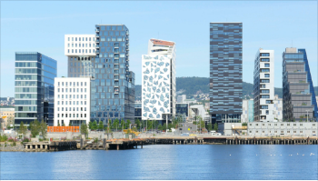
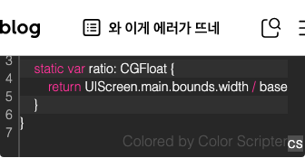
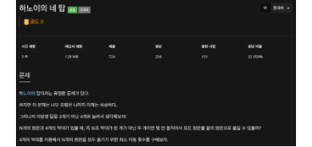
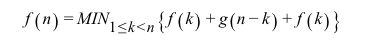
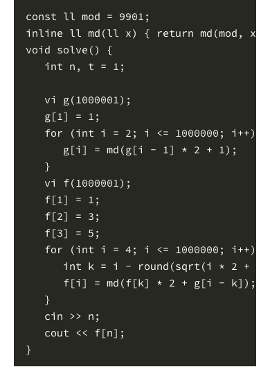
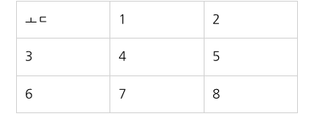

<p align="left">
  
</p>

# Goodbye Naver Blog

[](https://codecov.io/gh/mym0404/goodbye-naver-blog)

네이버 블로그 공개 글을 스캔해서 Markdown, frontmatter, 로컬 자산, 복구 가능한 `manifest.json`으로 export하는 도구입니다.


## 핵심

- `SE2`, `SE3`, `ONE(SE4)` 글을 한 번에 export할 수 있습니다.
- 여러 에디터에서 쓰는 본문 블록을 폭넓게 지원합니다.
- 이미지와 썸네일은 중복 저장을 줄이면서 정리합니다.
- 필요하면 export 뒤에 PicGo(PicList) 기반 여러 image provider로 이미지를 업로드하고 Markdown 경로를 바꿉니다.
- 로컬 웹 UI에서 범위 선택과 옵션 조절까지 바로 할 수 있습니다.

지원 범위는 공개 글만입니다.

## 빠른 시작

### 요구 사항

- Node.js `20+`
- pnpm

### 설치

```bash
git clone https://github.com/mym0404/goodbye-naver-blog.git
cd goodbye-naver-blog
pnpm install
```

### 실행

```bash
pnpm start
```

브라우저에서 [http://localhost:4173](http://localhost:4173) 을 열면 됩니다.

기본 흐름은 아래와 같습니다.

1. 블로그 ID 또는 URL 입력
2. 공개 글 스캔
3. 카테고리/날짜 범위 선택
4. export 실행
5. `output/` 아래 결과 확인

## 출력 예시

```text
output/
  개발/
    JavaScript/
      2024-01-02-hello-world/
        index.md
  public/
    2a4c...9f.png
  manifest.json
```

## 실제 예시

### SE2 link image

[원문 보기](https://blog.naver.com/mym0404/221504285266)



```markdown

```

### SE2 paragraph

[원문 보기](https://blog.naver.com/mym0404/221504285266)


```markdown
우선 아래와 같은 클래스를 하나 만들어준다.
```

### SE2 code block

[원문 보기](https://blog.naver.com/mym0404/221504285266)



````markdown
```
class Device {
    // Base width in point, use iPhone 6
    static let base: CGFloat = 375
    static var ratio: CGFloat {
        return UIScreen.main.bounds.width / base
    }
}
```
````

### SE4 link card

[원문 보기](https://blog.naver.com/mym0404/223034929697)


```markdown
[9942번: 하노이의 네 탑](https://www.acmicpc.net/problem/9942)

9942번 제출 맞힌 사람 숏코딩 재채점 결과 채점 현황 질문 게시판 하노이의 네 탑 다국어 시간 제한 메모리 제한 제출 정답 맞힌 사람 정답 비율 3 초 128 MB 724 204 151 32.059% 문제 하노이의 탑 이라는 유명한 문제가 있다. 하지만 이 문제는 너무 유명한 나머지 이제는 식상하다. 그러니까 이번엔 탑을 3개가 아닌 4개로 늘려서 생각해보자! N개의 원판과 4개의 막대가 있을 때, 즉 보조 막대가 한 개가 아닌 두 개이면 몇 번 움직여서 모든 원판을 끝의 원판으로 옮길 수 있을까? 4개의 막대를 이용해서 N개의...
```

### SE4 image

[원문 보기](https://blog.naver.com/mym0404/223034929697)



```markdown

```

### SE4 quote

[원문 보기](https://blog.naver.com/mym0404/222619228134)


```markdown
> Description & Relation
```

### SE4 formula

[원문 보기](https://blog.naver.com/mym0404/223034929697)



```markdown
$$
f\left(n\right)=MIN_{1\le k<n}\left\{f\left(k\right)+g\left(n-k\right)+f\left(k\right)\right\}
$$
```

### SE4 code block

[원문 보기](https://blog.naver.com/mym0404/223034929697)



````markdown
```javascript
const ll mod = 9901;
inline ll md(ll x) { return md(mod, x); }
void solve() {
   int n, t = 1;

   vi g(1000001);
   g[1] = 1;
   for (int i = 2; i <= 1000000; i++) {
      g[i] = md(g[i - 1] * 2 + 1);
   }
   vi f(1000001);
   f[1] = 1;
   f[2] = 3;
   f[3] = 5;
   for (int i = 4; i <= 1000000; i++) {
      int k = i - round(sqrt(i * 2 + 1)) + 1;
      f[i] = md(f[k] * 2 + g[i - k]);
   }
   cin >> n;
   cout << f[n];
}
```
````

### SE4 video

[원문 보기](https://blog.naver.com/mym0404/221302086471)


```markdown
[휴머노이드 첫 Rigging 성공 애니메이션](https://blog.naver.com/mym0404/221302086471)
```

### SE4 table

[원문 보기](https://blog.naver.com/mym0404/221302086471)



```markdown
| ㅗㄷ | 1 | 2 |
| --- | --- | --- |
| 3 | 4 | 5 |
| 6 | 7 | 8 |
```
