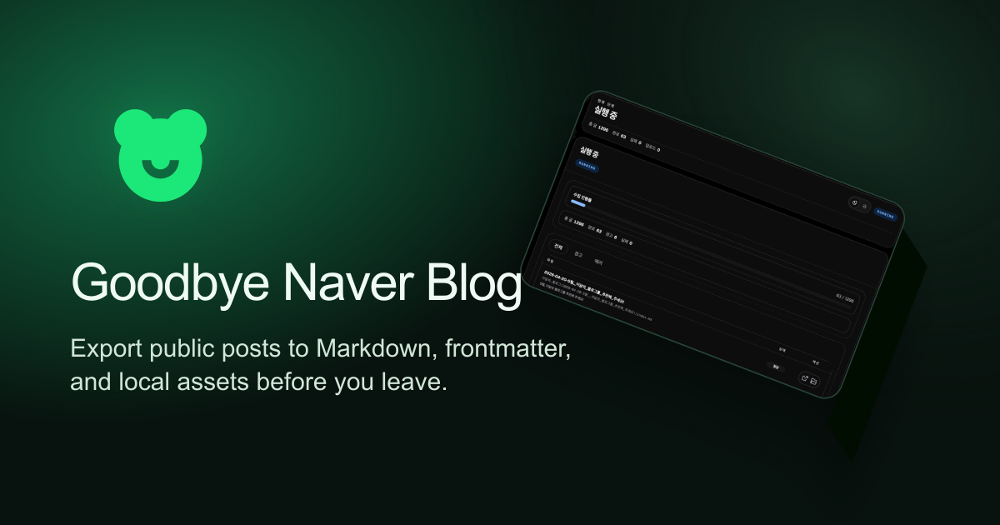
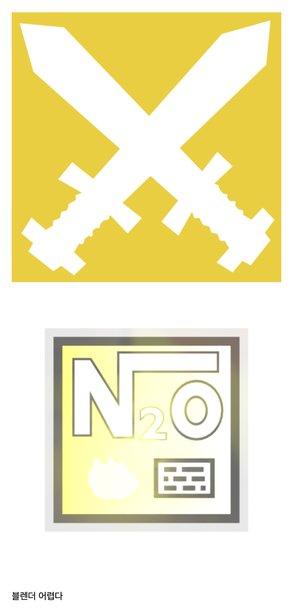
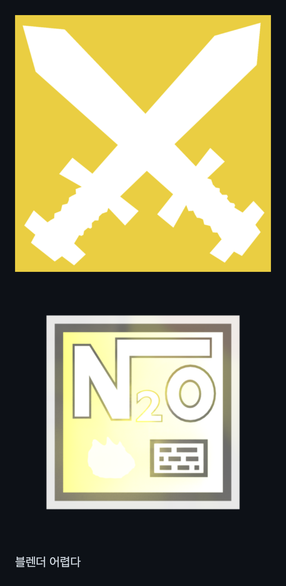
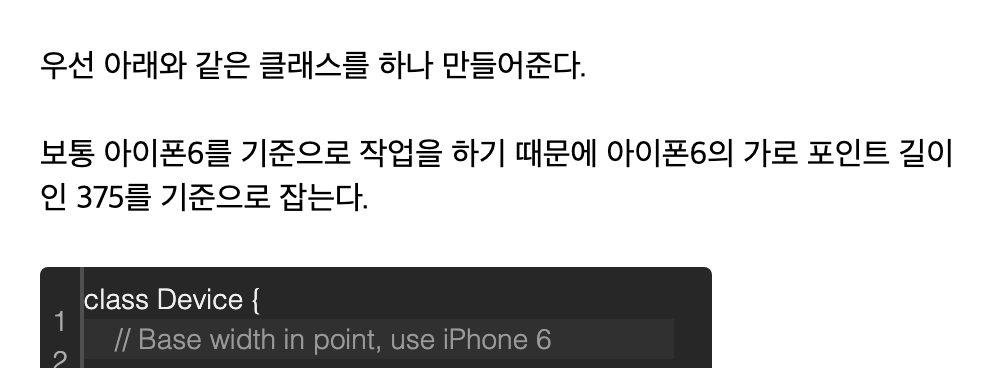
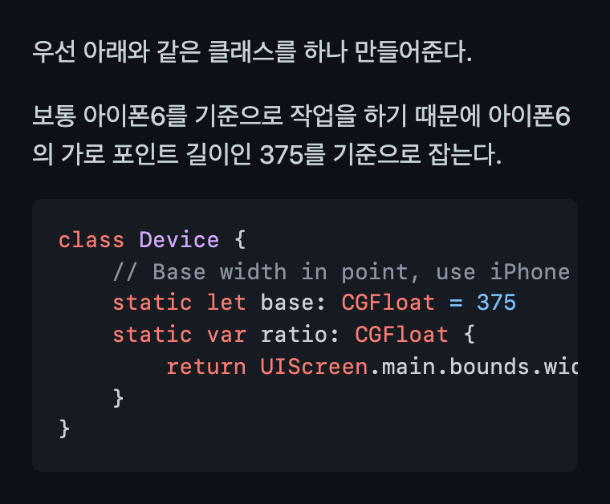
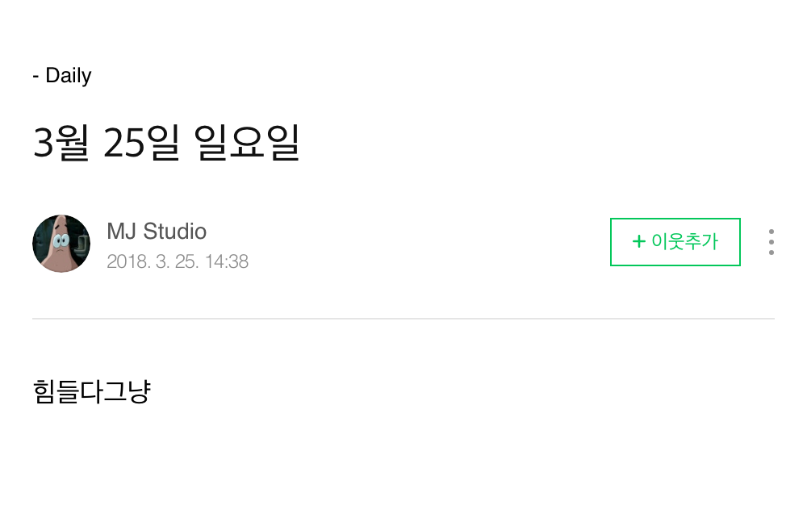
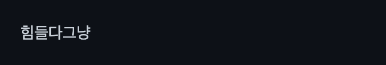
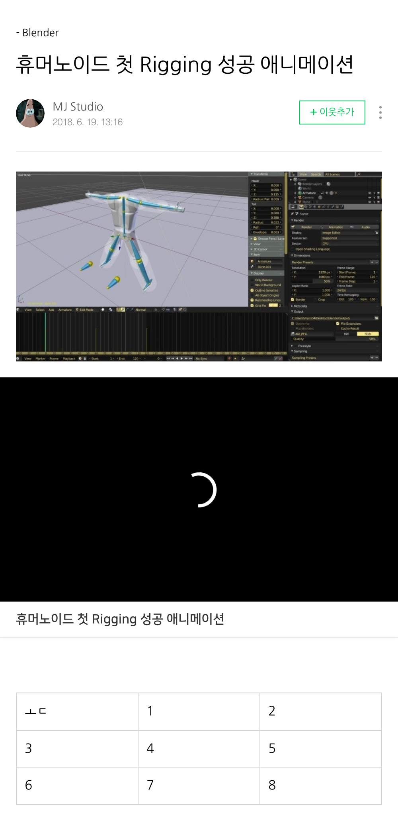
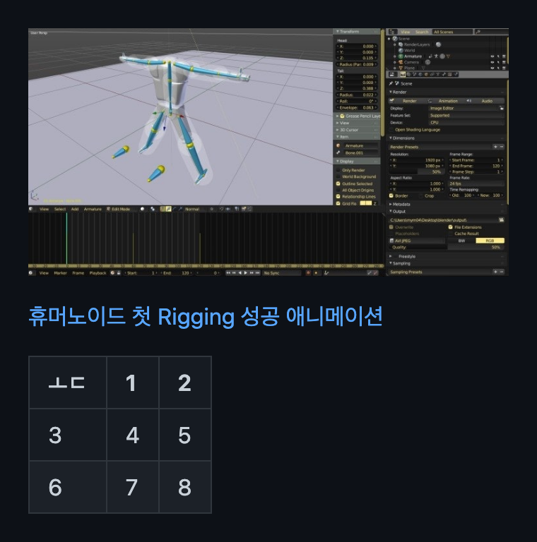

<p align="left">
  
</p>

# Goodbye Naver Blog

[](https://codecov.io/gh/mym0404/farewell-naver-blog)

네이버 블로그 공개 글을 스캔해서 Markdown, frontmatter, 로컬 자산, 복구 가능한 `manifest.json`으로 export하는 도구입니다.



## 핵심

- `SE2`, `SE3`, `ONE(SE4)` 글을 한 번에 export할 수 있습니다.
- 여러 에디터에서 쓰는 본문 블록을 폭넓게 지원합니다.
- 이미지와 썸네일은 중복 저장을 줄이면서 정리합니다.
- 필요하면 export 뒤에 PicGo(PicList) 기반 여러 image provider로 이미지를 업로드하고 Markdown 경로를 바꿉니다.
- 로컬 웹 UI에서 범위 선택과 옵션 조절까지 바로 할 수 있습니다.

지원 범위는 공개 글만입니다.

## 빠른 시작

### 요구 사항

- Node.js `20+`
- pnpm

### 설치

```bash
git clone https://github.com/mym0404/farewell-naver-blog.git
cd farewell-naver-blog
pnpm install
```

### 실행

```bash
pnpm start
```

브라우저에서 [http://localhost:4173](http://localhost:4173) 을 열면 됩니다.

기본 흐름은 아래와 같습니다.

1. 블로그 ID 또는 URL 입력
2. 공개 글 스캔
3. 카테고리/날짜 범위 선택
4. export 실행
5. `output/` 아래 결과 확인

## 출력 예시

```text
output/
  개발/
    JavaScript/
      2024-01-02-hello-world/
        index.md
  public/
    2a4c...9f.png
  manifest.json
```

## 실제 예시

<table>
  <thead>
    <tr>
      <th>기능</th>
      <th>네이버 블로그</th>
      <th>마크다운</th>
    </tr>
  </thead>
  <tbody>
    <tr>
      <td>SE2 이미지 묶음</td>
      <td></td>
      <td></td>
    </tr>
    <tr>
      <td>SE2 코드 블록</td>
      <td></td>
      <td></td>
    </tr>
    <tr>
      <td>SE3 일반 본문</td>
      <td></td>
      <td></td>
    </tr>
    <tr>
      <td>ONE 동영상 + 표</td>
      <td></td>
      <td></td>
    </tr>
  </tbody>
</table>

